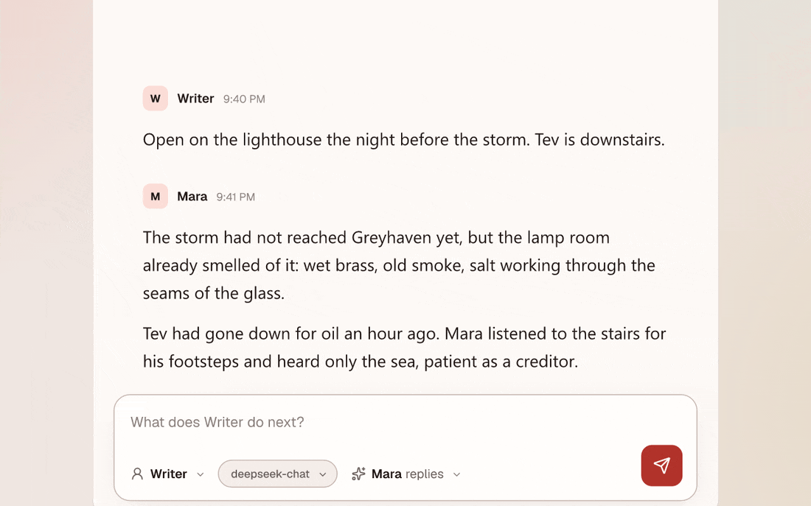
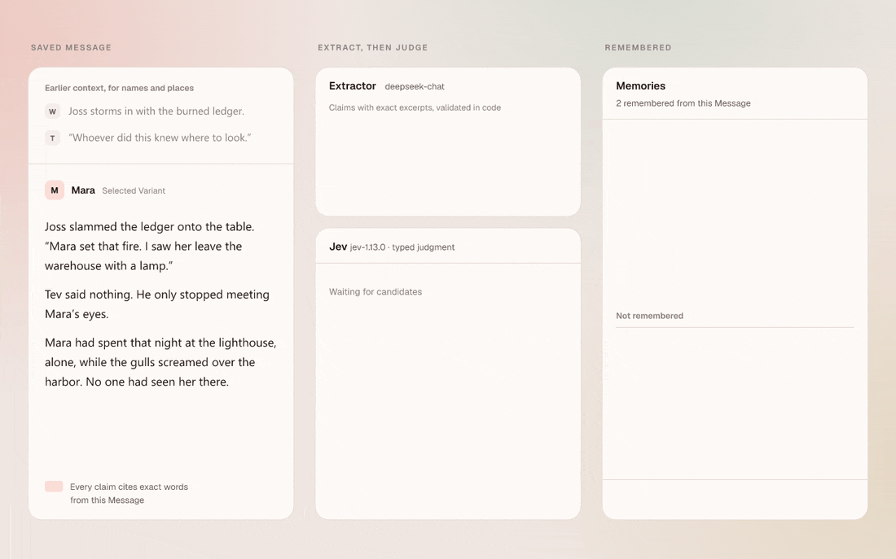
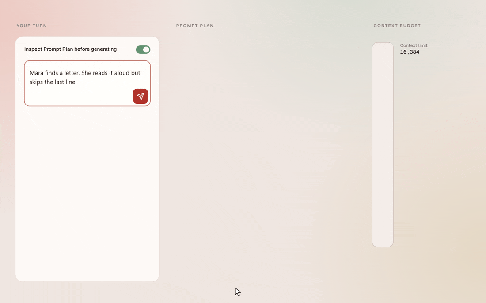
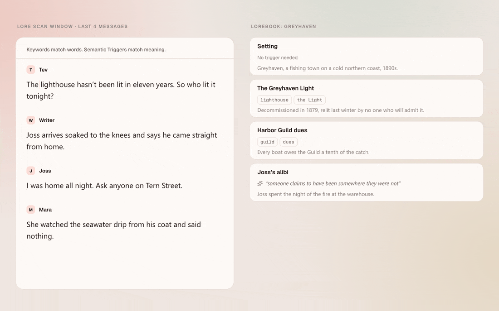
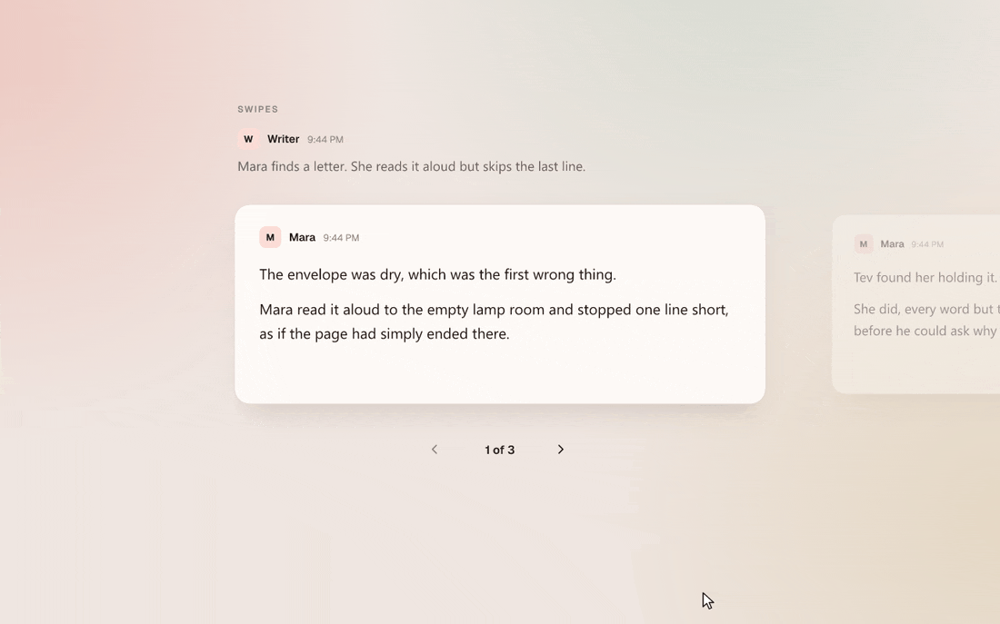

<h1 align="center">DitzyTavern</h1>

<p align="center">
A writing studio for AI-assisted stories. You steer, the model writes, and every reply shows you what went into it.
</p>

<p align="center">
  <picture>
    <source media="(prefers-color-scheme: dark)" srcset="docs/media/hero-evening.gif">
    
  </picture>
</p>

It runs locally. One Bun process serves the app and keeps everything in SQLite.

## Memory that knows who said what

<p align="center">
  <picture>
    <source media="(prefers-color-scheme: dark)" srcset="docs/media/memory-evening.gif">
    
  </picture>
</p>

Long stories fall out of the context window. Memory keeps compact claims about what happened, learned from the story itself, and recalls the relevant ones for each Generation.

The hard part is attribution. "Joss says Mara set the fire" and "Mara set the fire" are different stories. So is "Tev heard the accusation" versus "Tev believes it." Memory works in two steps:

1. **An extractor model proposes claims.** Each claim carries its attribution and exact excerpts from the Message. Code checks that every excerpt appears in the source word for word.
2. **Jev, a model from Typesafe, judges each claim with three separate typed questions.** Is it supported by the whole Message? Is the attribution correct? Is it worth keeping? Memory keeps a claim only when Jev finds it supported, correctly attributed, and useful above a confidence threshold. Jev never writes or rewrites a claim.

In the animation, the extractor overreaches with "Tev believes Mara set the fire." Tev only heard it, so Jev answers `not established` and the claim is dropped.

## See the prompt before it's sent

<p align="center">
  <picture>
    <source media="(prefers-color-scheme: dark)" srcset="docs/media/prompt-evening.gif">
    
  </picture>
</p>

Turn on "Inspect Prompt Plan before generating" and Send opens the assembled Prompt Plan instead of calling the model. It shows six blocks with token estimates: main prompt, character, Lore, Memories, history and your guidance. A gauge compares the total against the context limit. Edit any block and "Send exact plan" sends what you see, without reassembling it. The edit applies to that one Generation. Your preset stays unchanged.

Every finished Message keeps its Generation details: the model, settings, the captured Prompt Plan, and which Lore and Memories went in.

## Lore that matches meaning as well as words

<p align="center">
  <picture>
    <source media="(prefers-color-scheme: dark)" srcset="docs/media/lore-evening.gif">
    
  </picture>
</p>

Lorebooks work the way SillyTavern's World Info does: entries with Keywords, a scan window over recent Messages, and Always entries. DitzyTavern adds Semantic Triggers, plain-language descriptions of when an entry matters. "Someone claims to have been somewhere they were not" fires on "I was home all night" even though the two share no words.

Selected entries go into a Lore Block, capped by a Lore Allowance. Your prompt preset decides where the block goes. Each Generation records which entries it considered and why it kept or skipped each one. Attach a book to a character, a participant or a whole Chat.

## Swipes

<p align="center">
  <picture>
    <source media="(prefers-color-scheme: dark)" srcset="docs/media/swipes-evening.gif">
    
  </picture>
</p>

Every generated Message keeps all its alternatives. Next on the last Swipe generates a new one. Switching a Swipe on an older Message opens a preview first. Later Messages stay as they are until you confirm the change.

## Also in the box

- **SillyTavern imports.** Bring in `.jsonl` chats with all their Swipes, World Info books and prompt presets. An imported chat becomes an ordinary Chat. DitzyTavern keeps the original file, detects duplicate imports, and reports anything it could not map.
- **Prompt presets with macro syntax.** `{{random}}`, `{{roll}}`, `{{pick}}`, `{{if}}`, `{{setvar}}` and the other variable macros; `{{char}}` and `{{user}}` convert on import. Macro variables carry through Swipes, so each alternative keeps its own state.
- **Generations run on the server.** Close the tab mid-reply and the Generation keeps going. Reopen it and the stream resumes.
- **Connection profiles.** Add OpenAI-compatible endpoints, each with its own model list. DitzyTavern encrypts API keys at rest with a local key.
- **Daylight and evening themes.** Custom themes are in progress.

## Running it

You need [Bun](https://bun.sh) 1.3.

```sh
bun install
bun run build
bun run start        # http://127.0.0.1:3000
```

The server listens on loopback only. On first start it writes a `CONNECTION_SECRET_KEY` to `.env`, which encrypts stored API keys; keep that file if you want your keys to survive. The database lives in `data/ditzytavern.sqlite` and migrates itself on start.

Add a connection profile under Connections, pick a model from the composer, and write. Memory and Semantic Triggers also need an embeddings connection profile and a Typesafe credential for Jev.

### Development

```sh
bun run dev:server   # API with --watch
bun run dev:client   # Vite on http://127.0.0.1:5173
bun run db:seed      # sample data; db:teardown removes exactly what it added
bun run check        # lint, contract checks, types and tests
```

[`CONTEXT.md`](CONTEXT.md) defines the domain terms, [`DESIGN.md`](DESIGN.md) holds the visual direction, and [`docs/adr`](docs/adr) records the architectural decisions.

---

<sub>The animations are drawn frame by frame in Rust with [fframes](https://github.com/dmtrKovalenko/fframes) by [dmtrKovalenko](https://github.com/dmtrKovalenko), using the app's own colors, fonts and icons.</sub>
