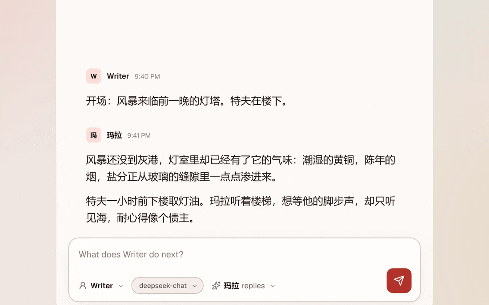
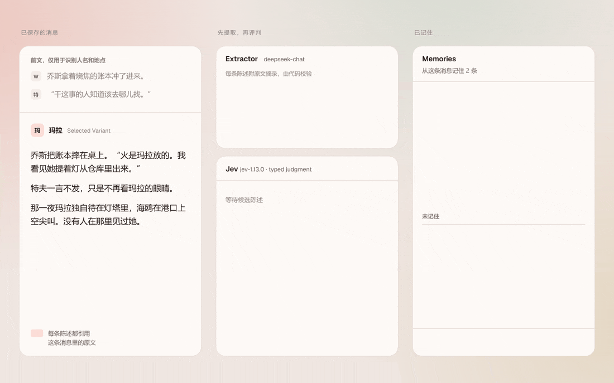
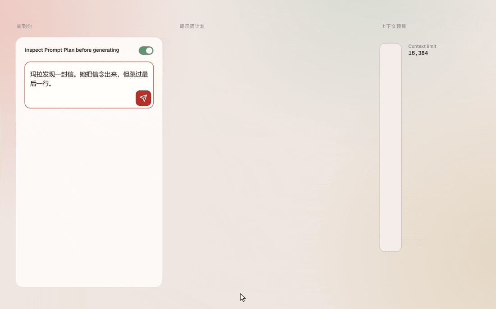
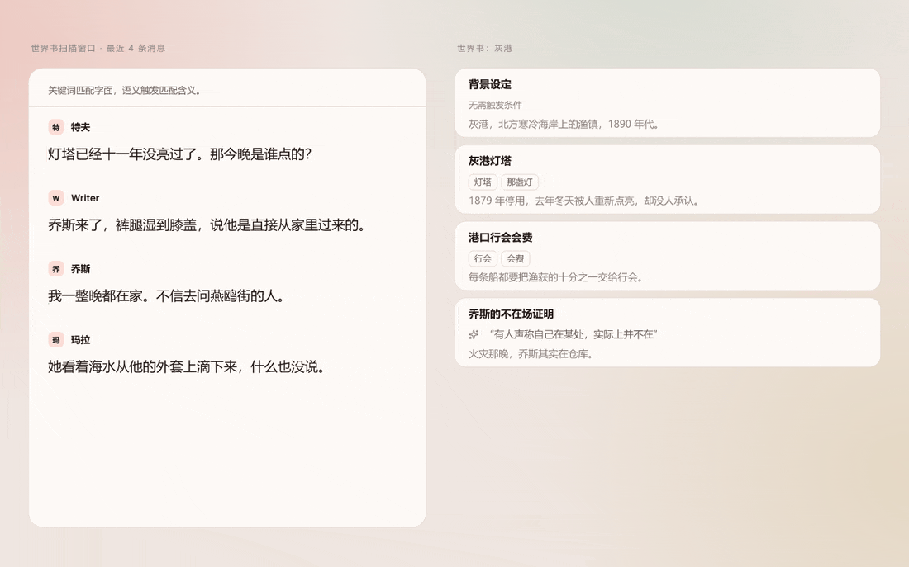
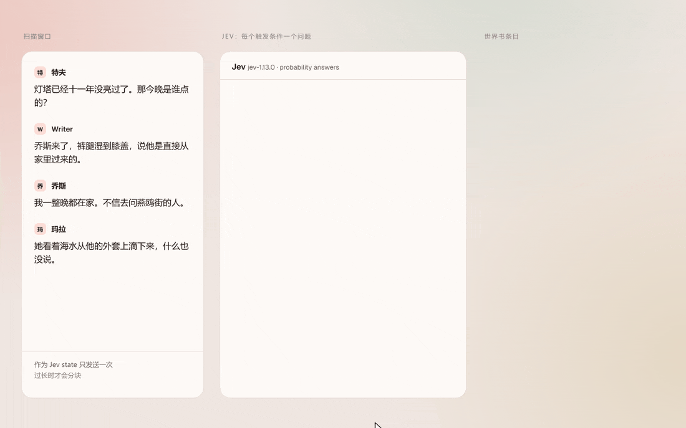
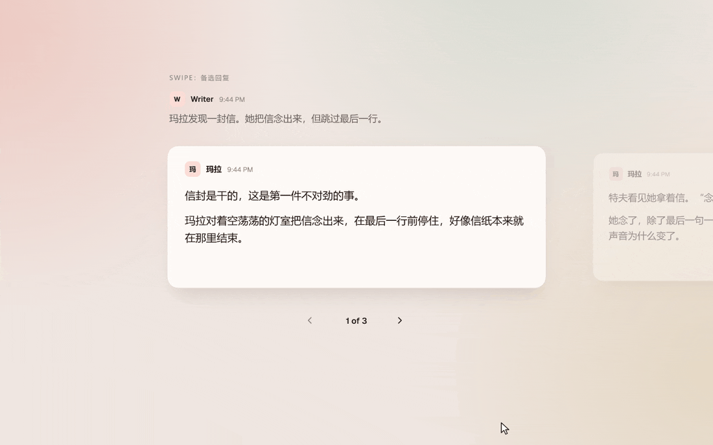

<h1 align="center">DitzyTavern</h1>

<p align="center">
<a href="README.md">English</a> · <b>简体中文</b>
</p>

<p align="center">
一个用 AI 写故事的工作室。你掌方向，模型执笔，每一条回复都能看到它是怎么来的。
</p>

<p align="center">
  <picture>
    <source media="(prefers-color-scheme: dark)" srcset="docs/media/zh-CN/hero-evening.gif">
    
  </picture>
</p>

DitzyTavern 在本地运行。一个 Bun 进程提供整个应用，所有数据都存在 SQLite 里。

界面目前只有英文，但故事、记忆和世界书都可以用中文写。下面的动图就是这样：界面是英文，故事是中文。

## 记得住“谁说了什么”的记忆

<p align="center">
  <picture>
    <source media="(prefers-color-scheme: dark)" srcset="docs/media/zh-CN/memory-evening.gif">
    
  </picture>
</p>

故事一长，早先的内容就会被挤出上下文窗口。记忆（Memory）从故事本身学到发生过的事，保存成简短的陈述，并在每次生成时召回相关的那几条。

难点在于归属。“乔斯说火是玛拉放的”和“火是玛拉放的”是两个不同的故事；“特夫听到了指控”和“特夫相信这个指控”也不一样。记忆分两步完成：

1. **提取模型提出陈述。** 每条陈述都带着归属，以及从消息里原样摘出的片段。代码会逐字核对，确认每段摘录都真的出现在原文中。
2. **决策模型用三个互相独立的类型化问题评判每条陈述。** 整条消息是否支持它？归属是否正确？值不值得保留？只有三项同时成立，并且保留概率达到门槛，默认 0.6，记忆才会保存这条陈述。决策模型只负责评判，从不撰写或改写陈述。

动图里，提取模型推断过头，提出了“特夫相信火是玛拉放的”。可特夫只是听到而已，所以 Jev 回答 `not established`，这条陈述被舍弃。

## 发送之前先看提示词

<p align="center">
  <picture>
    <source media="(prefers-color-scheme: dark)" srcset="docs/media/zh-CN/prompt-evening.gif">
    
  </picture>
</p>

打开 "Inspect Prompt Plan before generating" 后，按发送不会直接调用模型，而是先打开组装好的提示词计划（Prompt Plan）。它列出六个区块及各自的 token 估算：主提示词、角色、世界书、记忆、历史消息和你的指引。旁边的量表把总量和上下文上限放在一起比较。任意区块都可以修改，"Send exact plan" 会把你看到的内容原样发送，不再重新组装。修改只作用于这一次生成，预设保持不变。

每条生成完的消息都保留着生成详情：用了哪个模型、什么设置、当时的提示词计划，以及放进去了哪些世界书条目和记忆。

## 既认字面，也懂含义的世界书

<p align="center">
  <picture>
    <source media="(prefers-color-scheme: dark)" srcset="docs/media/zh-CN/lore-evening.gif">
    
  </picture>
</p>

世界书（Lorebook）的用法和 SillyTavern 的 World Info 一样：条目有关键词，扫描窗口覆盖最近几条消息，还有常驻条目。DitzyTavern 另外加入了语义触发（Semantic Trigger），也就是用平常的话描述某个条目什么时候该出场。“有人声称自己在某处，实际上并不在”能被“我一整晚都在家”触发，尽管两句话没有一个相同的词。

<p align="center">
  <picture>
    <source media="(prefers-color-scheme: dark)" srcset="docs/media/zh-CN/lore-jev-evening.gif">
    
  </picture>
</p>

含义是否匹配由所选决策模型判断。DitzyTavern 把扫描窗口作为 `scene` 发给决策模型，再把每个语义触发变成一个问题：这个情境是否在场景中发生或被谈到？决策模型为每个问题给出一个概率。场景太长或触发条件太多时，会拆成有限数量的请求，最多同时发送两个，每个触发条件取各分块中的最高概率。概率达到阈值就算匹配；阈值是所有条目共用的一个设置，默认 0.5，调高后较弱的匹配就会落选。结果不做缓存，每次生成都会重新提问。如果没有选择配置或无法连接，那次生成只使用关键词，生成详情里也会注明。

选中的条目放进 Lore Block，总量受 Lore Allowance 限制，区块放在哪里由你的提示词预设决定。每次生成都会记录它考虑过哪些条目，以及每个条目为什么被采用或跳过。一本世界书可以挂在角色、参与者或整个对话上。

## Swipe：同一条消息的多个版本

<p align="center">
  <picture>
    <source media="(prefers-color-scheme: dark)" srcset="docs/media/zh-CN/swipes-evening.gif">
    
  </picture>
</p>

每条生成的消息都保留它所有的备选版本。在最后一个 Swipe 上点下一个，就会生成新的一个。在较早的消息上切换 Swipe 时，会先进入预览；在你确认之前，后面的消息保持原样。

## 其他功能

- **导入 SillyTavern 数据。** 可以导入 `.jsonl` 聊天记录（连同全部 Swipe）、World Info 世界书和提示词预设。导入的聊天会成为普通对话。DitzyTavern 会保留原始文件，识别重复导入，并报告无法对应的内容。
- **支持宏语法的提示词预设。** `{{random}}`、`{{roll}}`、`{{pick}}`、`{{if}}`、`{{setvar}}` 及其他变量宏；`{{char}}` 和 `{{user}}` 会在导入时转换。宏变量随 Swipe 保存，每个备选版本各有自己的状态。
- **生成在服务器上运行。** 回复写到一半关掉标签页，生成也会继续；重新打开后，流式输出接着显示。
- **连接配置。** 可以添加兼容 OpenAI 的接口，每个接口有自己的模型列表。API 密钥用本地密钥加密保存。
- **日间和夜间主题。** 自定义主题正在开发中。

## 运行

需要 [Bun](https://bun.sh) 1.3。

```sh
bun install
bun run build
bun run start        # http://127.0.0.1:3000
```

服务器默认监听本机回环地址，可用 `HOST` 设置监听地址。首次启动时，它会把 `CONNECTION_SECRET_KEY` 写入 `.env`，用来加密保存的 API 密钥；想让密钥在重装后仍可用，就保留这个文件。数据库在 `data/ditzytavern.sqlite`，启动时会自动迁移。

Intel/AMD 和 ARM64 的 Docker 镜像发布到 `ghcr.io/tanjeeschuan/ditzytavern`。发布、配置和更新说明见 [Docker 与 GHCR 设置](docs/docker.md)（英文）。

在 Connections 里添加一个连接配置，在输入框里选好模型，就可以开始写了。记忆和语义触发还需要额外设置，两者要求不同：

- **记忆提取**：在 Memory Settings 里配置一个聊天连接和提取模型，并选择 System One 决策模型评判每条陈述。
- **记忆索引与召回**：在 Memory Settings 里配置一个 embeddings 连接和模型，并由记忆设置里选择的决策模型判断相关性。
- **语义触发**：在 Connections 的 Semantic Triggers 里独立选择 System One 配置与决策模型。语义触发不使用 embeddings。

Connections 提供 OpenRouter Decisions、TypeSafe 和空白 System One 预设。记忆与语义触发可以共用一个密钥，但选择不同模型。状态令牌限制默认 16,000；Clef 建议约 2,000。Lore 会分块读取场景，召回会裁剪场景，提取状态超限则明确报错。支持无需密钥的本地 HTTP 服务、自定义请求头和正数请求超时。

### 开发

```sh
bun run dev:server   # 带 --watch 的 API
bun run dev:client   # Vite，http://127.0.0.1:5173
bun run db:seed      # 示例数据；db:teardown 只删除它添加的内容
bun run check        # lint、契约检查、类型检查和测试
```

[`GLOSSARY.md`](GLOSSARY.md) 定义了领域术语，[`DESIGN.md`](DESIGN.md) 记录视觉方向，[`docs/adr`](docs/adr) 记录架构决策（均为英文）。

---

<sub>这些动图由 [dmtrKovalenko](https://github.com/dmtrKovalenko) 的 [fframes](https://github.com/dmtrKovalenko/fframes) 用 Rust 逐帧绘制。</sub>
